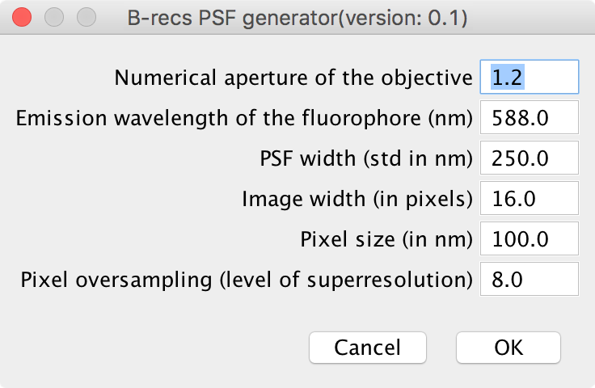

Fiji Plugin
===========

The *B-recs* package provides a plugin for *Image J / Fiji*. Once installed,
you can find the functions under the menu `Plugins > B-recs`.

PSF generator
-------------

*B-recs* uses PSF images in a particular format. In order to ease the use of
*B-recs*, you can generate a simple gaussian PSF via this function. Note
however that it is always better to produce a PSF that is specifically designed
to fit the real PSF of your optical system.
You need to enter a few parameters to produce the PSF:

* **Numerical aperture of the objective**
  Enter here the numerical aperture of your objective. Typical values are
  between 0.8 and 1.3.

* **Emission wavelength of the fluorophore (nm)**
  Emission wavelength of your fluorophore (509 nm for GFP).

* **PSF width (FWHM in nm)**
  If you don't know the value of the PSF width, you can enter instead the
  numerical aperture of your objective and the emission wavelength of your
  fluorophore of interest. The width of the PSF will then be automatically
  updated with the formula:

  .. math::
     FWHM = 0.4\, \lambda\, /\, NA

* **Image width (in pixels)**
  Size of the PSF. This has to be a multiple of 8. It should be as small as
  possible (to increase the processing speed) while retaining all the extent of
  the PSF. In practive, it is either 8 or 16.

* **Pixel size (in nm)**
  Enter here the size of your camera pixels relative to your sample size: if
  the physical size of your camera pixel is 10 µm and
  the magnification of your objective is 100 px, you should enter here
  10 µm / 100 = 100 nm.

* **Pixel oversampling (level of superresolution)**
  Ratio of the number of pixel of the reconstructed image over the number of
  pixel of the measured image.  If your pixel size is 100 nm and you
  expect a effective superresolution of 20 nm, you should enter 5 here.

Once generated, you will see a stack of images appear in *Image J*. This stack
can be readily used for the 2d reconstruction.

2D reconstruction
-----------------

This is the core of the plugin. The parameters are slightly trickier to tune.
If a set of parameter do not lead to a reasonable output, a few guidelines are
given at the end of this paragraph.

* **Dataset**
  This is where you provide an image to reconstruct. The image has to be in
  grayscale, in 16 bits format.

* **PSF**
  You can directly put here a PSF in the format generated by the `PSF
  generator` function of the plugin.

* **Background**
  It is possible to provide an image which gives the background level of each
  measured pixel. Typically this is an average over all the measured image or
  alternatively, an image measured after the sample is all bleached out.

* **Fluorophore mean intensity**
  Mean number of photons emitted by a fluorophore. In the simplest mode where
  the distribution of the number of emitted photons is gaussion, this is the
  mean of this distribution. A typical number is 2000 photons.

* **Fluorophore intensity standard devitation**
  This the standard deviation of the gaussian distribution of the number of
  emitted photons. Again, a typical number is 300.
  The prior of the intensity of each reconstructed pixel is given by:

  .. math::
     \psi(I) = (1 - \rho) \delta(I) + \frac{\rho}{\sqrt{2 \pi \sigma ^2}}
     \exp\left(-\frac{(I - I_m)^2}{2 \sigma^2}\right)

  RHO: density of fluorophores
  PIXMEAN: mean number of photons emitted by a fluorophore
  PIXSTD: standard deviation of this number of photons

* **Camera amplification factor**
  The input image is a grayscale image. The intensity of each pixel can be
  directly expressed in number of photons. In that case, the amplification
  factor would be 1. Otherwise, it is possible, as is often the case for CCD
  cameras, to have an amplification factor which gives the mean ration of the
  image intensity over the number of photons. A typical value for CCD cameras
  is 10.

* **Noise offset**
  The noise model for the detected photons is linear:
  :math:`\sigma = a + b * I`
  It means that there is a constant level of noise added to the expected photon
  shot noise of the measurement.
  The noise offset parameter is the factor `a`. It typically gives the level of
  the electronic noise of the detector. The factor `b` comes from the Poisson
  distribution and is equal to `1`.

* **Number of iterations**
  It happens very often that because of non-modelled noise in the image, the
  algorithm has trouble to fully converge. This parameter indicates the number
  of iterations after which *B-recs* stops whatever the level of convergence
  is.

* **Background intensity**
  If no image is provided for the background intensity, it is still possible to
  assume a uniform background level. This is this level in number of photons.

* **Dampening parameters**
  The help the algorithm to converge, the update of positions is dampended.  This
  is the "dirty" side of the algorithm and has to be adjusted by trial and error.
  DAMP is the amount of the relative intensity change (I usually use 0.1, but it
  should be lowered when the program fails to converge).

* **Temperature**
  (:math:`\beta`) of the algorithm

Guideline for the use of parameters
-----------------------------------

A really important parameter is the level of noise of the pixel. A common
mistae when using B-recs is the use a too low noise level. This will result in
*B-recs* assuming that details in the pictures should be accounted for by
florophore photons instead of background noise and make these levels
inconsistent the the PSF used. The algorithm in that scenario will always have
trouble to find something significant. It is always better to try with a high
level of noise first and the increase it progressively until obtaining
reasonable results. This problem should arise if you perfectly control your
optical and measurement system but this rarely completely happen.
