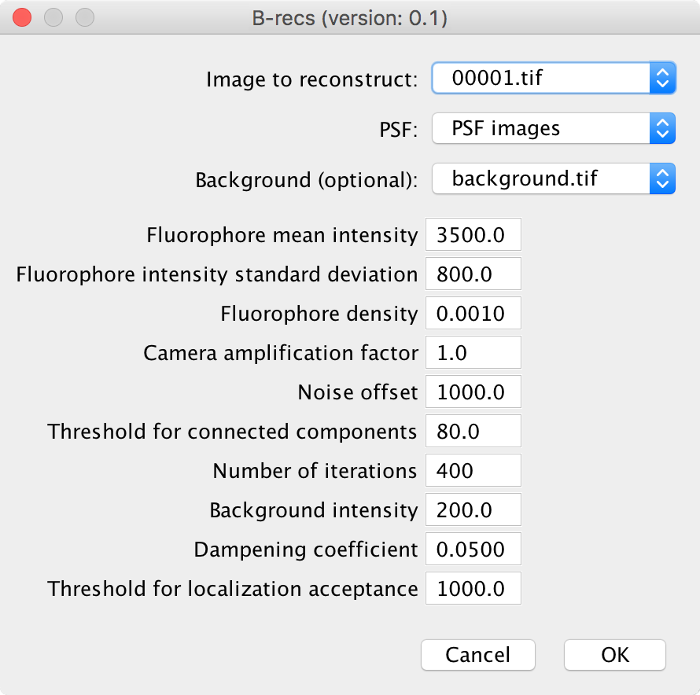

Fiji Plugin
===========

The *B-recs* package provides a plugin for *Image J / Fiji*. Once installed,
you can find the functions under the menu `Plugins > B-recs`.

PSF generator
-------------

*B-recs* uses PSF images in a particular format. In order to ease the use of
*B-recs*, you can generate a simple gaussian PSF via this function. Note
however that it is always better to produce a PSF that is specifically designed
to fit the real PSF of your optical system.
You need to enter a few parameters to produce the PSF:

.. image:: psf_generator.png
   :alt: Interface window for the PSF generation
   :width: 370px
   :align: center

* **Numerical aperture of the objective**
  Enter here the numerical aperture of your objective. Typical values are
  between 0.8 and 1.3.

* **Emission wavelength of the fluorophore (nm)**
  Emission wavelength of your fluorophore (509 nm for GFP).

* **PSF width (FWHM in nm)**
  If you don't know the value of the PSF width, you can enter instead the
  numerical aperture of your objective and the emission wavelength of your
  fluorophore of interest. The width of the PSF will then be automatically
  updated with the formula:

  .. math::
     FWHM = 0.4\, \lambda\, /\, NA

* **Image width (in pixels)**
  Size of the PSF. This has to be a multiple of 8. It should be as small as
  possible (to increase the processing speed) while retaining all the extent of
  the PSF. In practive, it is either 8 or 16.

* **Pixel size (in nm)**
  Enter here the size of your camera pixels relative to your sample size: if
  the physical size of your camera pixel is 10 µm and
  the magnification of your objective is 100 px, you should enter here
  10 µm / 100 = 100 nm.

* **Pixel oversampling (level of superresolution)**
  Ratio of the number of pixel of the reconstructed image over the number of
  pixel of the measured image.  If your pixel size is 100 nm and you
  expect a effective superresolution of 20 nm, you should enter 5 here.

Once generated, you will see a stack of images appear in *Image J*. This stack
can be readily used for the 2d reconstruction.

2D reconstruction
-----------------

This is the core of the plugin. The parameters are slightly trickier to tune.
If a set of parameter do not lead to a reasonable output, a few guidelines are
given at the end of this paragraph.

* **Dataset**
  This is where you provide an image to reconstruct. The image has to be in
  grayscale, in 16 bits format. You can input a single 2D image or a stack.

* **PSF**
  You can directly put here a PSF in the format generated by the `PSF
  generator` function of the plugin.

* **Background**
  It is possible to provide an image which gives the background level of each
  measured pixel. Typically this is an average over all the measured image or
  alternatively, an image measured after the sample is all bleached out.
  A more straightforward way to obtain the background level but which is less
  accurate in the case of a very dense sample is to take the median over the
  whole stack of images to reconstruct.

  This parameters can also help with taking into account the different levels
  measured when not sample is present (this is typically the "hot" pixels
  observed with CMOS cameras). Hence, for CMOS cameras, the `Background`
  parameters can be an image acquired when the shutter is present.

  It is possible (although not necessary) to use a stack of background images.
  In that case, you should make sure that the number of slices is identical to
  that of the main dataset stack.

* **Fluorophore mean intensity**
  Mean number of photons emitted by a fluorophore. In the simplest mode where
  the distribution of the number of emitted photons is gaussion, this is the
  mean of this distribution. A typical number is 2000 photons.

* **Fluorophore intensity standard devitation**
  This the standard deviation of the gaussian distribution of the number of
  emitted photons. Again, a typical number is 300.
  The prior of the intensity of each reconstructed pixel is given by:

  .. math::
     \psi(I) = (1 - \rho) \delta(I) + \frac{\rho}{\sqrt{2 \pi \sigma ^2}}
     \exp\left(-\frac{(I - I_m)^2}{2 \sigma^2}\right)

  * :math:`\rho`: density of fluorophores
  * :math:`I_m`: mean number of photons emitted by a fluorophore (fluorohore
                 mean intensity parameter).
  * :math:`\sigma`: standard deviation of this number of photons (fluorophore
                    intensity standard deviation parameter).

* **Fluorophore density**
  This is the :math:`\rho` parameter of the previous equation

* **Camera amplification factor**
  The input image is a grayscale image. The intensity of each pixel can be
  directly expressed in number of photons. In that case, the amplification
  factor would be 1. Otherwise, it is possible, as is often the case for CCD
  cameras, to have an amplification factor which gives the mean ration of the
  image intensity over the number of photons. A typical value for CCD cameras
  is 10.

* **Noise offset**
  The noise model for the detected photons is linear:
  :math:`\sigma = a + b * I`
  It means that there is a constant level of noise added to the expected photon
  shot noise of the measurement.
  The noise offset parameter is the factor `a`. It typically gives the level of
  the electronic noise of the detector. The factor `b` comes from the Poisson
  distribution and is equal to `1`.

* **Threshold for connected components**
  In order to speed up the algorithm, the image regions where the intensity is
  close to the background, and hence where fluorophore are absent are not taken
  into account. This threshold is the intensity level above the background that
  indicates the presence of a fluorophore. It is typically a few standard
  deviation of intensity distribution around the background.

* **Number of iterations**
  It happens very often that because of non-modelled noise in the image, the
  algorithm has trouble to fully converge. This parameter indicates the number
  of iterations after which *B-recs* stops whatever the level of convergence
  is.

* **Background intensity**
  If no image is provided for the background intensity, it is still possible to
  assume a uniform background level. This is this level in number of photons.

* **Dampening coefficient**
  In order to help the algorithm to converge, the update of a posteriori
  intensities is dampened. This coefficient should be below one. Generally a
  coefficient equal to one leads to instabilities in the algorithm (it is easy
  to detect it a posteriori in the reconstructed images). A coefficient 0.01 is
  on the safe side (but slow). I usually use 0.05 for 2D datasets.

* **Threshold for localization acceptance**
  After the algorithm run, you obtain an image gives the posterior
  superresolved intensities. From this image, it is possible to obtain a list
  of localization by thresholding. This thresholding value is the value of the
  intensity in the reconstructed image beyond which localizations are
  considered.

Guideline for the use of parameters
-----------------------------------

In localization microscopy, you generally have a stack of images to
reconstruct. I advise to run the first tests on a single image and once you
think everything is working well, you can reconstruct the full stack. Since
*B-recs* used several parameters that need to be tuned to your dataset, and
that the plugin is quite slow, it is much easier to start with a single image.

A really important parameter is the level of noise of the pixel. A common
mistake when using B-recs is the use a too low noise level. This will result in
*B-recs* assuming that details in the pictures should be accounted for by
fluorophore photons instead of background noise and make these levels
inconsistent with the PSF used. The algorithm in that scenario will always have
trouble to find something significant. It is always better to try with a high
level of noise first and the increase it progressively until obtaining
reasonable results. This problem should arise if you perfectly control your
optical and measurement system but this rarely completely occurs.

In the case you miss some of the spots, it could mean that the background level
you set was to high. Alternatively, it could mean that the distribution of the
number of photons emitted by a fluorophore is not set correctly (*ie* a too
high mean number of photons coupled with a too narrow standard deviation will
tend to miss many spots).
The opposite of the previous tendencies will lead to the appearance of many
spurious spots.

Test dataset
------------

A good dataset to test *B-recs* is provided by the ISBI challenge 2013
[ISBI2013]_.
The necessary files with the preprocessed datasets are available in the
``test`` folder of the *B-recs* package.

ISBI dataset 1
^^^^^^^^^^^^^^

The dataset 1 (in low density) has a background that is correlated in time and
space but not constant over the whole acquisition time. A simple idea to remove
the background in that case is to use a median filter in x, y and t with a
radius of 4 pixel in every plane direction and 2 pixels in t.
The resulting stack is called ``background.tif``.
Removing this background from the measured images, and collecting the total
intensity around a few spots allows to determine the distribution of the number
of emitted photons (see the table below). Notice that it is also a good idea to
use a first guess and to refine this parameters a posteriori on the
localization intensities after a few runs.
Then by plotting the histogram of the intensities (again after the background
is removed), it is easy to determine a reasonable threshold for the connected
components determination: it is the upper value of the background distribution.
The dampening coefficient is the one I almost always use for 2D
reconstructions.

Here is set of parameters that give reasonable results:

========================================   ======
Fluorophore mean intensity                 3500
Fluorophore intensity standard deviation   800
Fluorophore density                        0.001
Camera amplification factor                1.0
Noise offset                               1000
Threshold for connected components         80
Number of iterations                       400
Dampening coefficient                      0.05
Threshold for localization acceptance      1000
========================================   ======

And for the PSF:

=============================================   ======
PSF width (FWHM in nm)                          260.0
Image width (in pixels)                         8
Pixel size (in nm)                              100.0
Pixel oversampling (level of superresolution)   8
=============================================   ======

The current version of the plugin do not allow for a progress bar. It should
take no longer than a few seconds to reconstruct an image.

.. [ISBI2013] Sage, D., Kirshner, H., Pengo, T., Stuurman, N., Min, J., Manley,
   S., & Unser, M. (2015).  Quantitative evaluation of software packages for
   single-molecule localization microscopy. Nature methods, 12(8), 717-724.
